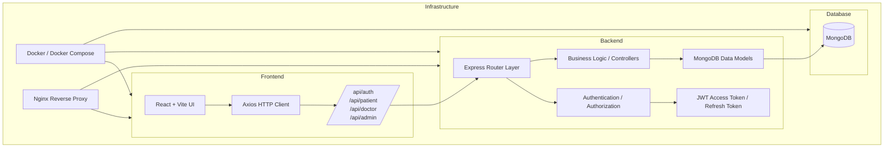
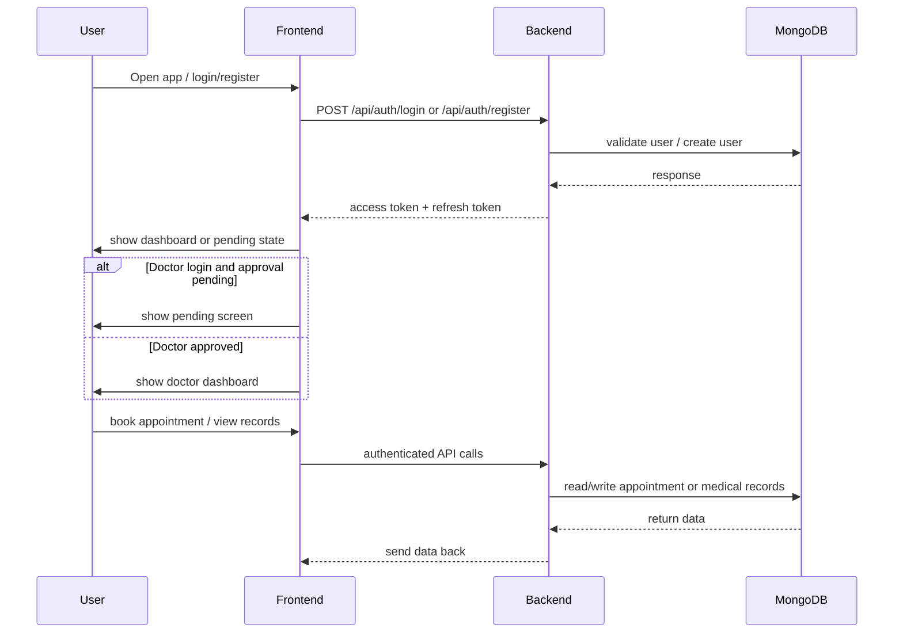

# MediLink Project Guide

## 1. Overview
MediLink is a healthcare platform with role-based access for patients, doctors, and admins. The project includes a React/Tailwind frontend, an Express/MongoDB backend, and security features like JWT authentication, refresh token rotation, and account lockout.

## 2. Architecture
The application follows a standard web architecture with separate frontend and backend layers.



### Explanation
- **Frontend**: React UI handles navigation, forms, and role-based dashboards.
- **Backend**: Express routes validate requests, manage auth, and perform CRUD operations.
- **Database**: MongoDB stores users, doctors, appointments, prescriptions, and medical records.
- **Infrastructure**: Docker Compose can orchestrate frontend, backend, and MongoDB together.

## 3. Project Flow
This section describes the main runtime flow of the application.



### Explanation
- **Login/Register**: Users authenticate and receive a short-lived access token and a long-lived refresh token.
- **Doctor approval**: Doctor accounts may require admin approval before access to the doctor dashboard.
- **Appointments and records**: Patient-facing booking and medical record access are authenticated backend flows.

## 4. CI/CD Flow
A typical CI/CD process for MediLink would look like this:

```mermaid
flowchart TD
  A[Developer Pushes Code] --> B[Source Control (Git)]
  B --> C[CI Pipeline]
  C --> D[Install Dependencies]
  C --> E[Run Tests]
  C --> F[Build Frontend & Backend]
  C --> G[Security / Lint Checks]
  C --> H[Deploy to Staging / Production]
  H --> I[Run Smoke Tests]
```

### Explanation
- **Source Control**: Code changes are pushed to Git.
- **CI Pipeline**: Automated builds and tests ensure code quality.
- **Deployment**: Successful builds can be deployed via Docker Compose, a cloud provider, or a container registry.

## 5. User Interaction
MediLink has three main user roles with distinct interactions.

### Patient
- Register and login
- Book appointments with doctors
- View appointment history
- Access medical records and prescriptions

### Doctor
- Register and wait for admin approval
- Manage appointments and availability
- View patient details and upload prescriptions
- Update appointment status and participate in consultation workflows

### Admin
- Approve or reject doctor registrations
- Manage users, doctors, and appointments
- Monitor the system for issues and perform administrative tasks

## 6. Security & Token Flow
The auth flow uses short-lived access tokens and longer-lived refresh tokens.

```mermaid
flowchart LR
  U[User] --> F[Frontend]
  F --> B[Backend Auth]
  B -->|access token| F
  B -->|refresh token cookie| F
  F -->|protected request| B
  B -->|verify access token| B
  alt access token expired
    F --> B: POST /api/auth/refresh
    B -->|new access token| F
  end
```

### Explanation
- **Access Token**: Short-lived JWT used for API authorization.
- **Refresh Token**: Longer-lived token stored securely and rotated on refresh.
- **Refresh endpoint**: Issues a new access token and optionally rotates the refresh token.

## 7. How to Use This Guide
- Use the diagrams to understand the overall system structure.
- Follow the flow charts for authentication and data lifecycle.
- Refer to the user interaction section to map features to roles.
- Use the CI/CD section as a starting point for automation setup.
